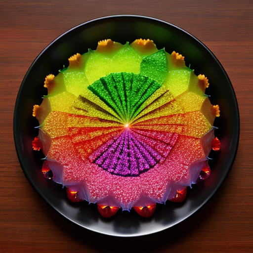

# FractalFoodGenerator

I was bored and than this happened

---

### Me:

I am quite hungry and I want to programm. Give me one single crazy project for me to develop. With details. Complexity doesnt matter. I also want to do some math.

### _Some_ LLM:

How about creating a "Fractal Food Generator" using a combination of programming and mathematics? This project will not only satisfy your hunger but also challenge your coding skills and mathematical understanding. Here's a detailed outline for the project:

**Project: Fractal Food Generator**

**Objective:**
Create a program that generates visually appealing fractal patterns, and for each generated pattern, associate a unique recipe based on the fractal structure.

**Technical Components:**

Fractal Generation:
Implement an algorithm to generate fractal patterns. You can choose from well-known fractal types like Mandelbrot, Julia, or any other more complex ones.

**User Interface:**
Create a graphical user interface (GUI) that displays the generated fractal in real-time. Use a library like Tkinter (Python), JavaFX (Java), or any other suitable framework.

**Mathematical Variations:**
Introduce mathematical variations to the fractal generation process. For example, you could modify parameters dynamically based on user input, creating a more interactive and customizable experience.

**Recipe Generation:**
Associate each fractal pattern with a unique recipe. Use mathematical properties of the fractal (such as iteration counts, coordinates, or color patterns) to determine ingredients and cooking instructions.

**Recipe Database:**
Develop a database or file system to store a variety of recipes. Each entry should correspond to a specific fractal pattern.

**User Interaction:**
Allow users to explore different fractals, and upon selecting one, provide the associated recipe. You could also implement a rating system for users to provide feedback on the generated recipes.

**Advanced Features:**
Add features like sharing generated fractals and recipes with other users, exporting recipes to popular cooking apps, or integrating machine learning to predict user preferences based on their interactions.

**Mathematics Integration:**

**Fractal Mathematics:**
Dive into the mathematical principles behind fractals. Understand the formulas and algorithms used to generate fractal patterns.

**Recipe Mapping:**
Experiment with mapping mathematical properties of fractals to real-world ingredients and cooking instructions. For example, certain patterns could represent spicy dishes, while others might indicate desserts.

**Dynamic Parameters:**
Allow users to manipulate parameters of the fractal equation and observe how it affects both the visual pattern and the generated recipe. This can involve tweaking coefficients, exponents, or other mathematical variables.

Remember to document your code well, share your progress, and enjoy the creative process of combining programming and mathematics in a tasty project!

### Me:

Remember to document your code well ... nah
